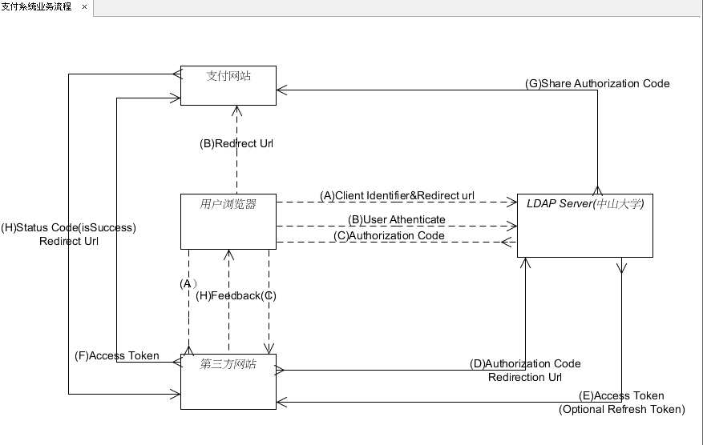

#第五次小组作业报告

学号：12354002 陈昊琦  
学号：13331077 侯文林  
学号：13331060 郭柏杨  
学号：13331088 黄玲玲  
学号：13331089 黄钦开  
学号：13331109 黎峰君  
学号：13331112 李承权  
学号：13331158 林义涵  
学号：13331369 周国城

###1、通讯图

###2、业务流程
**(A)** 用户访问第三方网站，后者将前者导向中山大学认证服务器。  
**(B)**	用户选择是否给第三方网站授权。  
**(C)**	假设用户授权，中山大学认证服务器将用户导向第三方网站事先制定的“重定向 URI”,同时附上一个授权码。  
**(D)**	第三方网站收到授权码，附上早先的“重定向 URI”,向中山大学认证服务器申请令牌。这一步是在第三方网站的后台的服务器上完成的，对用户不可见。  
**(E)**	中山大学认证服务器核对了授权码和重定向URI,确认无误后，向第三方网站发送访问令牌和更新令牌。
###3、HTTP协议内容
(A)  
1.	**response\_type**: 授权类型，此处为code，必选。  
2.	**client\_id**: 表示第三方网站的id，必选。  
3.	**重定向URI**: 必选项，重定向到中山大学认证服务器的认证页面。  
4.	**scope**: 表示权限范围，可选。  
5.	**state**： 表示第三方网站的当前状态，可以指定任意值，认证服务器会原封不动地返回这个值。  

(B)  
1.	**code**： 表示授权码，必选项。该码的有效期应该很短，通常设为 10 分钟，客户端只能使用该码一次，否则会被授权服务器拒绝。该码与客户端 ID 和重定向URI，是一一对应关系。  
2.	**state**： 如果客户端的请求中包含这个参数，认证服务器的回应也必须一模一样包含这个参数。  

(C)  
1.  **grant\_type**： 表示使用的授权模式，必选项，此处的值固定为"authorization\_code"。  
2.  **code**： 表示上一步获得的授权码，必选项。  
3.  **redirect\_uri**： 表示重定向 URI，必选项，且必须与 A 步骤中的该参数值保持一致。  
4.  **client_id**： 表示客户端ID，必选项。

(D)  
1.	**access\_token**： 表示访问令牌，必选项。  
2.	**token\_type**： 表示令牌类型，该值大小写不敏感，必选项，可以是 bearer 类型或 mac 类型。  
3.	**expires\_in**： 表示过期时间，单位为秒。如果省略该参数，必须其他方式设置过期时间。  
4.	**refresh\_token**： 表示更新令牌，用来获取下一次的访问令牌，可选项。  
5.	**scope**： 表示权限范围，如果与客户端申请的范围一致，此项可省略。
###4、API接口列表
1.**sign_up：** 注册校内账号，以使用校内平台支付功能。  
输入参数：  
<table>
<thead>
<tr>
  <th>名称</th>
  <th>类型</th>
  <th>描述</th>
</tr>
</thead>
<tbody>
<tr>
  <td>username</td>
  <td>string</td>
  <td>用户名</td>
</tr>
<tr>
  <td>password</td>
  <td>string</td>
  <td>密码</td>
</tr>
</tbody>
</table>
返回结果：  
<table>
<thead>
<tr>
  <th>名称</th>
  <th>类型</th>
  <th>描述</th>
</tr>
</thead>
<tbody>
<tr>
  <td>msg</td>
  <td>string</td>
  <td>结果描述</td>
</tr>
</tbody>
</table>
2.**sign_in:**  登录校内支付账号，以使用校内平台支付功能。  
输入参数：  
<table>
<thead>
<tr>
  <th>名称</th>
  <th>类型</th>
  <th>描述</th>
</tr>
</thead>
<tbody>
<tr>
  <td>username</td>
  <td>string</td>
  <td>用户名</td>
</tr>
<tr>
  <td>password</td>
  <td>string</td>
  <td>密码</td>
</tr>
</tbody>
</table>
返回结果：  
<table>
<thead>
<tr>
  <th>名称</th>
  <th>类型</th>
  <th>描述</th>
</tr>
</thead>
<tbody>
<tr>
  <td>msg</td>
  <td>string</td>
  <td>结果描述</td>
</tr>
</tbody>
</table>
3.**order_query:**  查询订单状态  
输入参数：  
<table>
<thead>
<tr>
  <th>名称</th>
  <th>类型</th>
  <th>描述</th>
</tr>
</thead>
<tbody>
<tr>
  <td>pid</td>
  <td>integer</td>
  <td>订单序号</td>
</tr>
<tr>
  <td>sid</td>
  <td>string</td>
  <td>请求支付单位</td>
</tr>
</tbody>
</table>
返回结果：  
<table>
<thead>
<tr>
  <th>名称</th>
  <th>类型</th>
  <th>描述</th>
</tr>
</thead>
<tbody>
<tr>
  <td>good_name</td>
  <td>string</td>
  <td>货品名称</td>
</tr>
<tr>
  <td>good_count</td>
  <td>integer</td>
  <td>货品数量</td>
</tr>
<tr>
  <td>good_price</td>
  <td>double</td>
  <td>货品单价</td>
</tr>
</tbody>
</table>
4.**get_user\_info:**  查询账号信息
输入参数：  
<table>
<thead>
<tr>
  <th>名称</th>
  <th>类型</th>
  <th>描述</th>
</tr>
</thead>
<tbody>
<tr>
  <td>username</td>
  <td>string</td>
  <td>用户名</td>
</tr>
</tbody>
</table>
返回结果：  
<table>
<thead>
<tr>
  <th>名称</th>
  <th>类型</th>
  <th>描述</th>
</tr>
</thead>
<tbody>
<tr>
  <td>money</td>
  <td>double</td>
  <td>可用余额</td>
</tr>
<tr>
  <td>order_count</td>
  <td>integer</td>
  <td>订单数量</td>
</tr>
</tbody>
</table>
5.**ask_for\_pay:** 支付请求
输入参数：  
<table>
<thead>
<tr>
  <th>名称</th>
  <th>类型</th>
  <th>描述</th>
</tr>
</thead>
<tbody>
<tr>
  <td>username</td>
  <td>string</td>
  <td>用户名</td>
</tr>
<tr>
  <td>password</td>
  <td>string</td>
  <td>密码</td>
</tr>
<tr>
  <td>good_name</td>
  <td>string</td>
  <td>货品名称</td>
</tr>
<tr>
  <td>good_price</td>
  <td>double</td>
  <td>货品单价</td>
</tr>
<tr>
  <td>good_number</td>
  <td>integer</td>
  <td>货品数量</td>
</tr>
</tbody>
</table>
返回结果：  
<table>
<thead>
<tr>
  <th>名称</th>
  <th>类型</th>
  <th>描述</th>
</tr>
</thead>
<tbody>
<tr>
  <td>msg</td>
  <td>string</td>
  <td>返回结果</td>
</tr>
</tbody>
</table>
###5、潜在安全威胁
1. **DDOS攻击**  
校内的认证服务器与支付服务器可能会被大量的DDOS访问攻击，用户代理和第三方网站没有收到访问回应，导致认证和支付功能奔溃。  
2. **中间人攻击**  
授权码、Access Token及重定向URL可能会被拦截，被破解风险还是存在的，或者导致传输失败、收到篡改后的结果或二次结果，可能会发生重复交易的现象。
3.	**数据库泄露**  
储存着用户信息、交易数据的数据库可能会因被攻击而发生数据泄露，造成大量用户和第三方网站的财产损失。